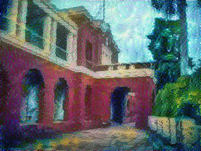

# Neural-Style-Transfer


## Installation(Ubuntu):
 Requirement:
 1. TensorFlow
 2. Keras
 3. Numpy
 4. Scipy
 5. Pretrained-VGG19 Weigths
 
* Clone this Repo
* Download [Pretrained-VGG19 Weigths](http://www.vlfeat.org/matconvnet/models/imagenet-vgg-verydeep-19.mat) in pretrained-model
* Run
      ```bash
         pip install --upgrade tensorflow-gpu \
                               keras \
                               numpy \
                               scipy 
      ```
* Change in Variables.py 'STYLE_IMAGE' and 'CONTENT_IMAGE' for their paths 
* Run
     ```bash
          python3 Training.py
       ```
## Example





## Note:
   IMAGE_WIDTH,IMAGE_HEIGHT,NOISE_RATIO,LEARNINF_RATE,NUM_ITERATIONS can pe changed at Variables.py
   #####Part of this code is taken from Deeplearning.ai#####
